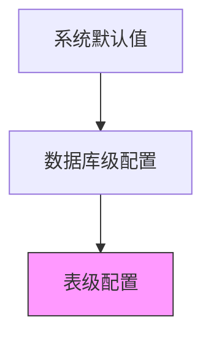

# FastLCDP 完整使用指南

本文档是FastLCDP XML项目的完整配置指南，包含XML配置说明、表继承功能详解和XSD校验使用指南。

## 目录

1. [XML配置说明](#xml配置说明)
2. [表继承功能详解](#表继承功能详解)
3. [XSD校验使用指南](#xsd校验使用指南)

---

# XML配置说明

## 概述

FastLCDP 是一个基于XML配置的数据库表结构生成工具，支持通过XML文件定义数据库结构，包括表、字段、索引、关系和表继承等功能。本文档详细描述了XML配置文件的格式、元素含义和配置规则。

## XML文档结构

### 根元素：database

数据库定义的根元素，包含整个数据库的配置信息。

```xml
<database name="数据库名" version="版本号" charset="字符集" collation="排序规则" comment="数据库注释">
    <tables>
        <!-- 表定义 -->
    </tables>
</database>
```

#### 属性说明

| 属性 | 类型 | 必填 | 说明 | 示例 |
|------|------|------|------|------|
| name | String | 是 | 数据库名称 | `blog_system` |
| version | String | 否 | 数据库版本 | `1.0.0` |
| charset | CharsetType | 否 | 默认字符集，表级别可继承 | `utf8mb4` |
| collation | CollationType | 否 | 默认排序规则 | `utf8mb4_general_ci` |
| engine | EngineType | 否 | 默认存储引擎，表级别可继承 | `InnoDB` |
| comment | String | 否 | 数据库注释 | `电商平台数据库` |

#### 支持的字符集类型（CharsetType）

| 值 | 说明 |
|------|------|
| `utf8` | UTF-8字符集（最多3字节） |
| `utf8mb4` | UTF-8字符集（最多4字节，推荐） |
| `latin1` | Latin-1字符集 （1个字符占1个字节） |
| `gbk` | GBK中文字符集 |
| `binary` | 二进制字符集 |

##### 各数据库字符集对应关系

| CharsetType | H2 | MySQL | PostgreSQL | SQLite | Oracle | SQL Server |
|-------------|----|----|----|----|----|-----------|
| `utf8` | UTF8 | utf8 | UTF8 | UTF-8 | AL32UTF8 | - |
| `utf8mb4` | UTF8 | utf8mb4 | UTF8 | UTF-8 | AL32UTF8 | UTF-8 |
| `latin1` | ISO8859_1 | latin1 | LATIN1 | - | WE8ISO8859P1 | Latin1_General_CI_AS |
| `gbk` | - | gbk | - | - | ZHS16GBK | Chinese_PRC_CI_AS |
| `binary` | BINARY | binary | - | BINARY | - | Latin1_General_BIN |

#### 支持的排序规则类型（CollationType）

| 值 | 说明 |
|------|------|
| `utf8_general_ci` | UTF-8通用排序规则（不区分大小写） |
| `utf8mb4_general_ci` | UTF-8MB4通用排序规则（不区分大小写，推荐） |
| `latin1_swedish_ci` | Latin-1西欧语排序规则  |
| `gbk_chinese_ci` | GBK中文排序规则 |
| `binary` | 二进制排序规则（区分大小写） |

##### 各数据库排序规则对应关系

| CollationType | H2 | MySQL | PostgreSQL | SQLite | Oracle | SQL Server |
|---------------|----|----|----|----|----|-----------|
| `utf8_general_ci` | - | utf8_general_ci | - | NOCASE | - | SQL_Latin1_General_CP1_CI_AS |
| `utf8mb4_general_ci` | - | utf8mb4_general_ci | - | NOCASE | - | SQL_Latin1_General_CP1_CI_AS |
| `latin1_swedish_ci` | - | latin1_swedish_ci | - | - | - | Latin1_General_CI_AS |
| `gbk_chinese_ci` | - | gbk_chinese_ci | - | - | - | Chinese_PRC_CI_AS |
| `binary` | - | binary | C | BINARY | BINARY | Latin1_General_BIN |

> **注意**：H2和PostgreSQL主要通过数据库级别设置排序规则，SQLite的排序规则相对简单，Oracle使用NLS参数控制排序行为。

#### 支持的存储引擎类型（EngineType）

| 值 | 说明 |
|------|------|
| `InnoDB` | 支持事务、外键的存储引擎（推荐） |
| `MyISAM` | 高性能的非事务存储引擎 |
| `Memory` | 内存存储引擎 |
| `Archive` | 压缩存储引擎 |

##### 各数据库存储引擎对应关系

| EngineType | H2 | MySQL | PostgreSQL | SQLite | Oracle | SQL Server |
|------------|----|----|----|----|----|-----------|
| `InnoDB` | - | InnoDB | - | - | - | - |
| `MyISAM` | - | MyISAM | - | - | - | - |
| `Memory` | - | MEMORY | - | :memory: | - | - |
| `Archive` | - | ARCHIVE | - | - | - | - |

> **注意**：存储引擎主要是MySQL的概念。H2、PostgreSQL、Oracle、SQL Server有自己的存储机制，不直接对应MySQL的存储引擎概念。SQLite的`:memory:`表示内存数据库。

## 表定义：table

表是数据库的基本组成单元，包含字段、索引、关系等定义。

```xml
<table name="表名" comment="表注释" extends="父表名" engine="存储引擎" charset="字符集">
    <fields>
        <!-- 字段定义 -->
    </fields>
    <indexes>
        <!-- 索引定义 -->
    </indexes>
    <relations>
        <!-- 关系定义 -->
    </relations>
</table>
```

### 表属性说明

| 属性 | 类型 | 必填 | 说明 | 示例 |
|------|------|------|------|------|
| name | String | 是 | 表名 | `users` |
| comment | String | 否 | 表注释 | `用户表` |
| extends | String | 否 | 继承的父表名 | `base_entity` |
| type | TableTypeEnum | 否 | 表类型，默认ENTITY | `ABSTRACT`, `ENTITY` |
| engine | EngineType | 否 | 存储引擎，未设置时继承数据库默认值 | `InnoDB` |
| charset | CharsetType | 否 | 表字符集，未设置时继承数据库默认值 | `utf8mb4` |
| collation | CollationType | 否 | 表排序规则，未设置时继承数据库默认值 | `utf8mb4_general_ci` |

#### 表类型说明（TableTypeEnum）

| 值 | 说明 |
|------|------|
| `ABSTRACT` | 抽象表，仅用于继承，不会生成实际的数据库表 |
| `ENTITY` | 实体表（默认），会生成实际的数据库表 |

### 属性继承规则
采用三级继承体系：

- 生效顺序：表级 > 数据库级 > 系统级
- 自动继承未显式声明的属性
- 支持`engine/charset/collation`三属性继承

#### 继承示例

```xml
<database name="example_db" charset="utf8mb4" engine="MyISAM">
    <tables>
        <!-- 表1：完全继承数据库配置 -->
        <table name="inherit_table" comment="继承数据库配置">
            <!-- 将使用 engine=MyISAM, charset=utf8mb4 -->
        </table>
        
        <!-- 表2：自定义配置，不继承 -->
        <table name="custom_table" engine="InnoDB" charset="latin1">
            <!-- 将使用 engine=InnoDB, charset=latin1 -->
        </table>
        
        <!-- 表3：部分继承 -->
        <table name="partial_table" engine="InnoDB">
            <!-- 将使用 engine=InnoDB（自定义）, charset=utf8mb4（继承） -->
        </table>
    </tables>
</database>
```

## 表继承功能详解

### 三级继承体系
采用「元数据层→业务基类→具体业务表」结构：
1. **元数据层**：定义审计字段（create/update相关）
2. **业务基类**：添加状态/排序等通用字段
3. **业务表**：实现具体业务逻辑字段

### 继承规则
| 继承要素 | 处理方式 |
|----------|----------|
| 字段     | 合并去重，子表优先 |
| 索引     | 全量继承，自动命名 |
| 外键     | 级联继承，自动约束 |

### 企业级示例
```xml
<!-- 多层继承结构 -->
<table name="base_audit" type="ABSTRACT" comment="审计基表">
    <fields>
        <field name="id" type="LONG" primaryKey="AUTO_INCREMENT" comment="主键ID"/>
        <field name="created_by" type="LONG" comment="创建人ID"/>
        <field name="updated_by" type="LONG" comment="更新人ID"/>
        <field name="created_time" type="DATETIME" defaultValue="CURRENT_TIMESTAMP" comment="创建时间"/>
        <field name="updated_time" type="DATETIME" defaultValue="CURRENT_TIMESTAMP ON UPDATE CURRENT_TIMESTAMP" comment="更新时间"/>
    </fields>
</table>

<table name="biz_entity" extends="base_audit" type="ABSTRACT" comment="业务基表">
    <fields>
        <field name="data_status" type="INTEGER" defaultValue="1" comment="数据状态：0-禁用，1-启用"/>
        <field name="sort_order" type="INTEGER" defaultValue="0" comment="排序顺序"/>
    </fields>
</table>

<table name="account" extends="biz_entity" comment="账户表">
    <fields>
        <field name="account_no" type="STRING" length="32" unique="true" comment="账号"/>
        <field name="account_name" type="STRING" length="100" comment="账户名称"/>
        <field name="balance" type="DECIMAL" precision="15" scale="2" defaultValue="0.00" comment="账户余额"/>
    </fields>
    <indexes>
        <index name="uk_account_no" type="UNIQUE">
            <columns>
                <column name="account_no"/>
            </columns>
        </index>
    </indexes>
</table>

<!-- 复合主键示例 -->
<table name="user_role_mapping" comment="用户角色映射表">
    <fields>
        <field name="user_id" type="LONG" primaryKey="COMPOSITE" comment="用户ID"/>
        <field name="role_id" type="LONG" primaryKey="COMPOSITE" comment="角色ID"/>
        <field name="granted_time" type="DATETIME" defaultValue="CURRENT_TIMESTAMP" comment="授权时间"/>
        <field name="granted_by" type="LONG" comment="授权人ID"/>
    </fields>
    <indexes>
        <index name="pk_user_role" type="PRIMARY">
            <columns>
                <column name="user_id"/>
                <column name="role_id"/>
            </columns>
        </index>
    </indexes>
</table>

<!-- UUID主键示例 -->
<table name="document" comment="文档表">
    <fields>
        <field name="doc_uuid" type="STRING" length="36" primaryKey="UUID" comment="文档UUID"/>
        <field name="title" type="STRING" length="200" comment="文档标题"/>
        <field name="content" type="TEXT" comment="文档内容"/>
        <field name="created_time" type="DATETIME" defaultValue="CURRENT_TIMESTAMP" comment="创建时间"/>
    </fields>
</table>
```

#### 继承示例
```xml
<!-- 基础实体表（抽象表） -->
<table name="base_entity" type="ABSTRACT" comment="基础实体表">
    <fields>
        <field name="id" type="LONG" primaryKey="AUTO_INCREMENT" comment="主键ID"/>
        <field name="created_time" type="DATETIME" defaultValue="CURRENT_TIMESTAMP" comment="创建时间"/>
        <field name="updated_time" type="DATETIME" defaultValue="CURRENT_TIMESTAMP ON UPDATE CURRENT_TIMESTAMP" comment="更新时间"/>
        <field name="is_deleted" type="BOOLEAN" length="1" defaultValue="0" comment="是否删除"/>
    </fields>
</table>

<!-- 用户表继承基础实体表 -->
<table name="users" extends="base_entity" comment="用户表">
    <fields>
        <field name="username" type="STRING" length="50" nullable="false" unique="true" comment="用户名"/>
        <field name="email" type="STRING" length="100" nullable="false" comment="邮箱"/>
        <field name="password" type="STRING" length="255" nullable="false" comment="密码"/>
    </fields>
    <indexes>
        <index name="idx_username" type="NORMAL">
            <columns>
                <column name="username"/>
            </columns>
        </index>
    </indexes>
</table>
```

## 字段定义：field

字段是表的基本组成部分，定义了数据的存储结构和约束。

```xml
<field name="字段名" 
       type="数据类型" 
       length="长度" 
       precision="数值精度" 
       scale="小数位数" 
       nullable="是否可空" 
       primaryKey="是否主键" 
       autoIncrement="是否自增" 
       unique="是否唯一"
       defaultValue="默认值" 
       comment="字段注释" />
```

### 字段属性说明

| 属性 | 类型 | 必填 | 说明 | 示例 |
|------|------|------|------|------|
| name | String | 是 | 字段名 | `username` |
| type | DataType | 是 | 数据类型，参见支持的数据类型 | `STRING`, `INTEGER`, `DECIMAL` |
| length | Integer | 否 | 字段长度（正整数） | `50`, `255` |
| precision | Integer | 否 | 数值精度（正整数，用于DECIMAL类型） | `10` |
| scale | Integer | 否 | 小数位数（非负整数，用于DECIMAL类型） | `2` |
| nullable | Boolean | 否 | 是否允许NULL，默认true | `false` |
| primaryKey | PrimaryKeyType | 否 | 主键类型，默认NONE | `SINGLE`, `COMPOSITE`, `AUTO_INCREMENT` |
| autoIncrement | Boolean | 否 | 是否自增，默认false | `true` |
| unique | Boolean | 否 | 是否唯一，默认false | `true` |
| defaultValue | String | 否 | 默认值 | `0`, `CURRENT_TIMESTAMP` |
| comment | String | 否 | 字段注释 | `用户名` |

#### 主键类型说明（PrimaryKeyType）

| 值 | 说明 |
|------|------|
| `NONE` | 非主键字段（默认） |
| `SINGLE` | 单字段主键 |
| `COMPOSITE` | 复合主键的组成字段 |
| `AUTO_INCREMENT` | 自增主键（通常用于整数类型） |
| `UUID` | UUID主键（通常用于字符串类型） |
| `SEQUENCE` | 序列主键（适用于支持序列的数据库） |

#### 主键类型使用示例

```xml
<!-- 自增主键 -->
<field name="id" type="LONG" primaryKey="AUTO_INCREMENT" comment="主键ID"/>

<!-- UUID主键 -->
<field name="uuid" type="STRING" length="36" primaryKey="UUID" comment="UUID主键"/>

<!-- 复合主键 -->
<field name="user_id" type="LONG" primaryKey="COMPOSITE" comment="用户ID"/>
<field name="role_id" type="LONG" primaryKey="COMPOSITE" comment="角色ID"/>

<!-- 序列主键 -->
<field name="seq_id" type="LONG" primaryKey="SEQUENCE" comment="序列主键"/>
```

### 支持的数据类型

根据XSD定义，系统支持以下数据类型：

#### 数值类型
- `INTEGER`：整数类型
- `LONG`：长整数类型
- `DECIMAL`：精确小数类型
- `BOOLEAN`：布尔类型

#### 字符串类型
- `CHAR`：定长字符串
- `STRING`：变长字符串
- `TEXT`：文本类型

#### 二进制类型
- `BLOB`：二进制大对象

#### 日期时间类型
- `DATETIME`：日期时间类型

#### JSON类型
- `JSON`：JSON数据类型

#### 各数据库字段类型对应关系

| DataType | H2 | MySQL | PostgreSQL | SQLite | Oracle | SQL Server |
|----------|----|----|----|----|----|-----------|
| `INTEGER` | INT | INT | INTEGER | INTEGER | NUMBER(10) | INT |
| `LONG` | BIGINT | BIGINT | BIGINT | INTEGER | NUMBER(19) | BIGINT |
| `DECIMAL` | DECIMAL(p,s) | DECIMAL(p,s) | DECIMAL(p,s) | REAL | NUMBER(p,s) | DECIMAL(p,s) |
| `BOOLEAN` | BOOLEAN | TINYINT(1) | BOOLEAN | INTEGER | NUMBER(1) | BIT |
| `CHAR` | CHAR(n) | CHAR(n) | CHAR(n) | TEXT | CHAR(n) | CHAR(n) |
| `STRING` | VARCHAR(n) | VARCHAR(n) | VARCHAR(n) | TEXT | VARCHAR2(n) | NVARCHAR(n) |
| `TEXT` | CLOB | TEXT | TEXT | TEXT | CLOB | NTEXT |
| `BLOB` | BLOB | BLOB | BYTEA | BLOB | BLOB | VARBINARY(MAX) |
| `DATETIME` | TIMESTAMP | DATETIME | TIMESTAMP | TEXT | DATE | DATETIME2 |
| `JSON` | JSON | JSON | JSON | TEXT | CLOB | NVARCHAR(MAX) |

> **注意**：
> - `p` 表示精度（precision），`s` 表示小数位数（scale），`n` 表示长度（length）
> - SQLite 使用动态类型系统，大多数类型存储为 TEXT 或 INTEGER
> - Oracle 的 DATE 类型包含日期和时间信息
> - SQL Server 推荐使用 NVARCHAR 以支持 Unicode 字符
> - 这些是XSD中定义的标准数据类型。在实际的SQL生成过程中，系统会根据目标数据库类型将这些通用类型映射为具体的数据库类型。

## 索引定义：index

索引用于提高查询性能，支持多种索引类型。

```xml
<index name="索引名" type="索引类型" method="索引方法" comment="索引注释">
    <columns>
        <column name="字段名" order="排序" length="索引长度"/>
    </columns>
</index>
```

### 索引属性说明

| 属性 | 类型 | 必填 | 说明 | 可选值 |
|------|------|------|------|--------|
| name | String | 是 | 索引名称 | `idx_username` |
| type | IndexTypeEnum | 否 | 索引类型，默认NORMAL | 参见索引类型说明 |
| comment | String | 否 | 索引注释 | `用户名索引` |

### 索引列属性说明

| 属性 | 类型 | 必填 | 说明 | 可选值 |
|------|------|------|------|--------|
| name | String | 是 | 字段名 | `username` |
| order | SortOrder | 否 | 排序方式，默认ASC | `ASC`, `DESC` |
| length | Integer | 否 | 索引长度（正整数，前缀索引） | `10` |

### 索引类型说明（IndexTypeEnum）

| 值 | 说明 |
|------|------|
| `PRIMARY` | 主键索引，唯一标识表中的每一行记录 |
| `UNIQUE` | 唯一索引，保证索引列的值在表中是唯一的 |
| `NORMAL` | 普通索引（默认），用于提高查询性能，允许重复值 |
| `FULLTEXT` | 全文索引，用于在文本字段中进行全文搜索 |
| `SPATIAL` | 空间索引，用于地理空间数据类型的索引 |

### 索引示例

```xml
<indexes>
    <!-- 普通索引 -->
    <index name="idx_email" type="NORMAL">
        <columns>
            <column name="email"/>
        </columns>
    </index>
    
    <!-- 唯一索引 -->
    <index name="uk_username" type="UNIQUE">
        <columns>
            <column name="username"/>
        </columns>
    </index>
    
    <!-- 复合索引 -->
    <index name="idx_name_age" type="NORMAL">
        <columns>
            <column name="last_name"/>
            <column name="first_name"/>
            <column name="age" order="DESC"/>
        </columns>
    </index>
    
    <!-- 前缀索引 -->
    <index name="idx_content_prefix" type="NORMAL">
        <columns>
            <column name="content" length="100"/>
        </columns>
    </index>
</indexes>
```

## 关系定义：relation

关系定义用于建立表之间的外键约束。

```xml
<relation name="外键名" 
          column="本表字段" 
          referenceTable="引用表" 
          referenceColumn="引用字段" 
          onDelete="删除动作" 
          onUpdate="更新动作" 
          type="关系类型" 
          comment="关系注释"/>
```

### 关系属性说明

| 属性 | 类型 | 必填 | 说明 | 示例 |
|------|------|------|------|------|
| name | String | 是 | 外键约束名 | `fk_user_profile` |
| column | String | 是 | 本表的外键字段 | `user_id` |
| referenceTable | String | 是 | 引用的表名 | `users` |
| referenceColumn | String | 是 | 引用表的字段 | `id` |
| onDelete | ReferentialAction | 否 | 删除时的动作，默认RESTRICT | 参见引用动作说明 |
| onUpdate | ReferentialAction | 否 | 更新时的动作，默认RESTRICT | 参见引用动作说明 |
| comment | String | 否 | 关系注释 | `用户档案外键` |

### 引用动作说明（ReferentialAction）

| 值 | 说明 |
|------|------|
| `RESTRICT` | 限制操作（默认），如果子表中存在相关记录，则阻止对父表的删除或更新操作 |
| `CASCADE` | 级联操作，当父表记录被删除或更新时，自动删除或更新子表中的相关记录 |
| `SET NULL` | 设置为空，当父表记录被删除或更新时，将子表中相关的外键字段设置为NULL |
| `NO ACTION` | 无动作，与RESTRICT类似，但检查时机可能不同（取决于数据库实现） |
| `SET DEFAULT` | 设置为默认值，当父表记录被删除或更新时，将子表中相关的外键字段设置为其默认值 |

### 关系示例

```xml
<relations>
    <!-- 用户档案关系 -->
    <relation name="fk_user_profile" 
              column="user_id" 
              referenceTable="users" 
              referenceColumn="id" 
              onDelete="CASCADE" 
              onUpdate="CASCADE" 
              comment="用户档案关联"/>
    
    <!-- 文章作者关系 -->
    <relation name="fk_post_author" 
              column="author_id" 
              referenceTable="users" 
              referenceColumn="id" 
              onDelete="RESTRICT" 
              onUpdate="CASCADE" 
              comment="文章作者关联"/>
</relations>
```

## 完整示例

以下是一个完整的XML配置示例，展示了博客系统的数据库结构：

```xml
<?xml version="1.0" encoding="UTF-8"?>
<database name="blog_system" version="1.0.0" charset="utf8mb4" collation="utf8mb4_unicode_ci" comment="博客系统数据库">
    <tables>
        <!-- 基础实体表 -->
        <table name="base_entity" comment="基础实体表">
            <fields>
                <field name="id" type="LONG" primaryKey="true" autoIncrement="true" comment="主键ID"/>
                <field name="created_time" type="DATETIME" defaultValue="CURRENT_TIMESTAMP" comment="创建时间"/>
                <field name="updated_time" type="DATETIME" defaultValue="CURRENT_TIMESTAMP ON UPDATE CURRENT_TIMESTAMP" comment="更新时间"/>
                <field name="is_deleted" type="BOOLEAN" length="1" defaultValue="0" comment="是否删除"/>
            </fields>
        </table>
        
        <!-- 用户表 -->
        <table name="users" extends="base_entity" comment="用户表">
            <fields>
                <field name="username" type="STRING" length="50" nullable="false" unique="true" comment="用户名"/>
                <field name="email" type="STRING" length="100" nullable="false" comment="邮箱"/>
                <field name="password" type="STRING" length="255" nullable="false" comment="密码"/>
                <field name="nickname" type="STRING" length="100" comment="昵称"/>
                <field name="avatar" type="STRING" length="255" comment="头像URL"/>
                <field name="status" type="BOOLEAN" length="1" defaultValue="1" comment="状态：0-禁用，1-启用"/>
            </fields>
            <indexes>
                <index name="uk_username" type="UNIQUE">
                    <columns>
                        <column name="username"/>
                    </columns>
                </index>
                <index name="uk_email" type="UNIQUE">
                    <columns>
                        <column name="email"/>
                    </columns>
                </index>
                <index name="idx_status" type="NORMAL">
                    <columns>
                        <column name="status"/>
                    </columns>
                </index>
            </indexes>
        </table>
        
        <!-- 文章表 -->
        <table name="posts" extends="base_entity" comment="文章表">
            <fields>
                <field name="title" type="STRING" length="200" nullable="false" comment="标题"/>
                <field name="content" type="STRING" comment="内容"/>
                <field name="summary" type="STRING" comment="摘要"/>
                <field name="author_id" type="LONG" nullable="false" comment="作者ID"/>
                <field name="category_id" type="LONG" comment="分类ID"/>
                <field name="status" type="BOOLEAN" length="1" defaultValue="0" comment="状态：0-草稿，1-发布"/>
                <field name="view_count" type="LONG" defaultValue="0" comment="浏览次数"/>
                <field name="like_count" type="LONG" defaultValue="0" comment="点赞次数"/>
            </fields>
            <indexes>
                <index name="idx_author" type="NORMAL">
                    <columns>
                        <column name="author_id"/>
                    </columns>
                </index>
                <index name="idx_category" type="NORMAL">
                    <columns>
                        <column name="category_id"/>
                    </columns>
                </index>
                <index name="idx_status" type="NORMAL">
                    <columns>
                        <column name="status"/>
                    </columns>
                </index>
                <index name="idx_created_time" type="NORMAL">
                    <columns>
                        <column name="created_time" order="DESC"/>
                    </columns>
                </index>
                <index name="ft_title_content" type="FULLTEXT">
                    <columns>
                        <column name="title"/>
                        <column name="content"/>
                    </columns>
                </index>
            </indexes>
            <relations>
                <relation name="fk_post_author" 
                          column="author_id" 
                          referenceTable="users" 
                          referenceColumn="id" 
                          onDelete="RESTRICT" 
                          onUpdate="CASCADE" 
                          comment="文章作者关联"/>
            </relations>
        </table>
        
        <!-- 评论表 -->
        <table name="comments" extends="base_entity" comment="评论表">
            <fields>
                <field name="post_id" type="LONG" nullable="false" comment="文章ID"/>
                <field name="user_id" type="LONG" nullable="false" comment="用户ID"/>
                <field name="parent_id" type="LONG" comment="父评论ID"/>
                <field name="content" type="STRING" nullable="false" comment="评论内容"/>
                <field name="status" type="BOOLEAN" length="1" defaultValue="1" comment="状态：0-隐藏，1-显示"/>
            </fields>
            <indexes>
                <index name="idx_post" type="NORMAL">
                    <columns>
                        <column name="post_id"/>
                    </columns>
                </index>
                <index name="idx_user" type="NORMAL">
                    <columns>
                        <column name="user_id"/>
                    </columns>
                </index>
                <index name="idx_parent" type="NORMAL">
                    <columns>
                        <column name="parent_id"/>
                    </columns>
                </index>
            </indexes>
            <relations>
                <relation name="fk_comment_post" 
                          column="post_id" 
                          referenceTable="posts" 
                          referenceColumn="id" 
                          onDelete="CASCADE" 
                          onUpdate="CASCADE" 
                          comment="评论文章关联"/>
                <relation name="fk_comment_user" 
                          column="user_id" 
                          referenceTable="users" 
                          referenceColumn="id" 
                          onDelete="CASCADE" 
                          onUpdate="CASCADE" 
                          comment="评论用户关联"/>
                <relation name="fk_comment_parent" 
                          column="parent_id" 
                          referenceTable="comments" 
                          referenceColumn="id" 
                          onDelete="CASCADE" 
                          onUpdate="CASCADE" 
                          comment="父评论关联"/>
            </relations>
        </table>
    </tables>
</database>
```

## 配置规则和最佳实践

### 命名规范

1. **数据库名**：使用小写字母和下划线，如 `blog_system`
2. **表名**：使用小写字母和下划线，复数形式，如 `users`, `posts`
3. **字段名**：使用小写字母和下划线，如 `user_id`, `created_time`
4. **索引名**：
   - 普通索引：`idx_字段名`，如 `idx_username`
   - 唯一索引：`uk_字段名`，如 `uk_email`
   - 全文索引：`ft_字段名`，如 `ft_title_content`
5. **外键名**：`fk_表名_字段名`，如 `fk_user_profile`

### 字段设计原则

1. **主键设计**：推荐使用自增的BIGINT类型作为主键
2. **时间字段**：统一使用DATETIME类型，设置默认值
3. **状态字段**：使用TINYINT类型，添加注释说明各状态含义
4. **字符串长度**：根据实际需求设置合理的长度
5. **NOT NULL约束**：除非业务确实需要，否则尽量设置为NOT NULL
6. **默认值**：为字段设置合理的默认值

### 索引设计原则

1. **主键索引**：自动创建，无需手动定义
2. **外键索引**：为外键字段创建索引
3. **查询索引**：为经常用于WHERE条件的字段创建索引
4. **复合索引**：遵循最左前缀原则
5. **避免过度索引**：索引会影响写入性能

### 外键关系原则

1. **级联删除**：谨慎使用CASCADE，避免误删数据
2. **引用完整性**：确保引用的表和字段存在
3. **性能考虑**：外键约束会影响性能，根据需要选择

### 字符集和排序规则

1. **推荐字符集**：utf8mb4（支持完整的UTF-8字符集）
2. **推荐排序规则**：utf8mb4_unicode_ci（支持多语言排序）
3. **一致性**：保持数据库、表、字段的字符集一致

### 继承设计原则

1. **基础实体**：创建包含通用字段的基础实体表
2. **继承层次**：建议不超过3层继承
3. **字段冲突**：避免子表定义与父表相同名称的字段
4. **循环检测**：系统会自动检测循环继承

## 常见问题

### Q: 表继承的深度有限制吗？
A: 理论上没有限制，但建议继承深度不超过3层，以保持结构清晰。

### Q: 子表可以重写父表的字段吗？
A: 不建议重写父表字段，这可能导致冲突。如需修改，建议在父表中进行。

### Q: 如何处理字段名冲突？
A: 系统会按照继承顺序合并字段，如果存在同名字段，后定义的会覆盖先定义的。

### Q: 外键引用的表必须在同一个XML文件中吗？
A: 是的，当前版本要求所有相关表都在同一个XML文件中定义。

### Q: 支持哪些数据库？
A: 当前支持的数据库包括：H2、MySQL、PostgreSQL、SQLite、Oracle、SQL Server，其他数据库的支持正在开发中。

### Q: 如何验证XML配置的正确性？
A: 项目针对XML文件定义了XSD（XML Schema Definition），建议通过XSD对XML进行静态配置验证。

## XSD类型定义总结

本节总结了database-schema.xsd中定义的所有类型和枚举，供开发者参考：

### 复杂类型（ComplexType）

| 类型名 | 说明 | 用途 |
|--------|------|------|
| `DatabaseType` | 数据库类型定义 | 根元素database的类型 |
| `TablesType` | 表集合类型定义 | 包含多个table元素 |
| `TableType` | 表类型定义 | 单个表的定义 |
| `FieldsType` | 字段集合类型定义 | 包含多个field元素 |
| `FieldType` | 字段类型定义 | 单个字段的定义 |
| `IndexesType` | 索引集合类型定义 | 包含多个index元素 |
| `IndexType` | 索引类型定义 | 单个索引的定义 |
| `IndexColumnsType` | 索引列集合类型定义 | 包含多个column元素 |
| `IndexColumnType` | 索引列类型定义 | 单个索引列的定义 |
| `RelationsType` | 关系集合类型定义 | 包含多个relation元素 |
| `RelationType` | 关系类型定义 | 单个外键关系的定义 |

### 简单类型（SimpleType）枚举

| 枚举名 | 可选值 | 说明 |
|--------|--------|------|
| `DataType` | INTEGER, LONG, DECIMAL, BOOLEAN, CHAR, STRING, TEXT, BLOB, DATETIME, JSON | 字段数据类型 |
| `CharsetType` | utf8, utf8mb4, latin1, gbk, binary | 字符集类型 |
| `CollationType` | utf8_general_ci, utf8mb4_general_ci, latin1_swedish_ci, gbk_chinese_ci, binary | 排序规则类型 |
| `EngineType` | InnoDB, MyISAM, Memory, Archive | 存储引擎类型 |
| `IndexTypeEnum` | PRIMARY, UNIQUE, NORMAL, FULLTEXT, SPATIAL | 索引类型 |
| `SortOrder` | ASC, DESC | 排序顺序 |
| `ReferentialAction` | RESTRICT, CASCADE, SET NULL, NO ACTION, SET DEFAULT | 外键引用动作 |

### 属性约束说明

- **required**：必填属性
- **optional**：可选属性
- **default**：默认值
- **positiveInteger**：正整数（>0）
- **nonNegativeInteger**：非负整数（≥0）
- **boolean**：布尔值（true/false）

---

# 表继承功能详解

## 概述

表继承是FastLCDP的核心特性之一，允许子表自动继承父表的字段、索引和关系定义，大大简化了数据库设计中的重复工作，提高了配置的可维护性和一致性。

## 继承机制原理

### 继承处理流程

1. **解析阶段**：XML解析器读取所有表定义，识别带有`extends`属性的表
2. **映射构建**：创建表名到表定义的映射关系
3. **继承处理**：递归处理每个表的继承关系
4. **循环检测**：防止循环继承导致的无限递归
5. **内容合并**：将父表的字段、索引、关系合并到子表中

### 核心实现代码

```java
/**
 * 处理所有表的继承关系
 */
private void processTableInheritance(DatabaseSchema schema) {
    Map<String, TableDefinition> tableMap = new HashMap<>();
    
    // 构建表名到表定义的映射
    for (TableDefinition table : schema.getTables()) {
        tableMap.put(table.getName(), table);
    }
    
    // 处理每个表的继承关系
    for (TableDefinition table : schema.getTables()) {
        if (table.getExtendsTable() != null && !table.getExtendsTable().isEmpty()) {
            processTableInheritance(table, tableMap, new ArrayList<>());
        }
    }
}

/**
 * 递归处理单个表的继承关系
 */
private void processTableInheritance(TableDefinition table, 
                                   Map<String, TableDefinition> tableMap, 
                                   List<String> processedTables) {
    // 循环继承检测
    if (processedTables.contains(table.getName())) {
        log.warn("检测到循环继承关系，表: {}", table.getName());
        return;
    }
    
    processedTables.add(table.getName());
    
    String parentTableName = table.getExtendsTable();
    if (parentTableName != null && !parentTableName.isEmpty()) {
        TableDefinition parentTable = tableMap.get(parentTableName);
        if (parentTable == null) {
            log.warn("找不到父表: {}，子表: {}", parentTableName, table.getName());
            return;
        }
        
        // 递归处理父表的继承关系
        if (parentTable.getExtendsTable() != null && !parentTable.getExtendsTable().isEmpty()) {
            processTableInheritance(parentTable, tableMap, new ArrayList<>(processedTables));
        }
        
        // 合并父表的字段（在子表字段之前）
        List<FieldDefinition> mergedFields = new ArrayList<>(parentTable.getFields());
        mergedFields.addAll(table.getFields());
        table.setFields(mergedFields);
        
        // 合并父表的索引
        List<IndexDefinition> mergedIndexes = new ArrayList<>(parentTable.getIndexes());
        mergedIndexes.addAll(table.getIndexes());
        table.setIndexes(mergedIndexes);
        
        // 合并父表的关联关系
        List<RelationDefinition> mergedRelations = new ArrayList<>(parentTable.getRelations());
        mergedRelations.addAll(table.getRelations());
        table.setRelations(mergedRelations);
        
        log.debug("表 {} 继承了父表 {} 的定义", table.getName(), parentTableName);
    }
}
```

## 继承规则详解

### 1. 字段继承规则

- **继承顺序**：父表字段会插入到子表字段列表的**前面**
- **字段合并**：父表和子表的字段会合并成一个完整的字段列表
- **重名处理**：如果父子表有同名字段，子表字段会保留（后定义覆盖先定义）
- **属性继承**：字段的所有属性（类型、长度、约束等）都会被继承

#### 示例

```xml
<!-- 父表 -->
<table name="base_entity">
    <fields>
        <field name="id" type="LONG" primaryKey="true" autoIncrement="true"/>
        <field name="created_time" type="DATETIME" defaultValue="CURRENT_TIMESTAMP"/>
        <field name="updated_time" type="DATETIME"/>
    </fields>
</table>

<!-- 子表 -->
<table name="users" extends="base_entity">
    <fields>
        <field name="username" type="STRING" length="50"/>
        <field name="email" type="STRING" length="100"/>
    </fields>
</table>
```

**继承后的users表字段顺序**：
1. `id` (来自base_entity)
2. `created_time` (来自base_entity)
3. `updated_time` (来自base_entity)
4. `username` (users表自有)
5. `email` (users表自有)

### 2. 索引继承规则

- **完整继承**：子表会继承父表的所有索引定义
- **索引合并**：父表索引和子表索引会合并
- **名称唯一性**：需要确保索引名称在合并后不冲突
- **字段依赖**：继承的索引必须基于已继承的字段

#### 示例

```xml
<!-- 父表 -->
<table name="base_entity">
    <fields>
        <field name="id" type="LONG" primaryKey="true"/>
        <field name="created_time" type="DATETIME"/>
    </fields>
    <indexes>
        <index name="idx_created_time" type="NORMAL">
            <columns>
                <column name="created_time"/>
            </columns>
        </index>
    </indexes>
</table>

<!-- 子表 -->
<table name="users" extends="base_entity">
    <fields>
        <field name="username" type="STRING" length="50"/>
    </fields>
    <indexes>
        <index name="uk_username" type="UNIQUE">
            <columns>
                <column name="username"/>
            </columns>
        </index>
    </indexes>
</table>
```

**继承后的users表索引**：
1. `idx_created_time` (来自base_entity)
2. `uk_username` (users表自有)

### 3. 关系继承规则

- **关系传递**：子表会继承父表的所有外键关系
- **引用有效性**：继承的外键关系必须基于已继承的字段
- **约束合并**：父表和子表的外键约束会合并
- **级联行为**：继承外键的级联行为保持不变

#### 示例

```xml
<!-- 父表 -->
<table name="base_entity">
    <fields>
        <field name="id" type="LONG" primaryKey="true"/>
        <field name="creator_id" type="LONG"/>
    </fields>
    <relations>
        <relation name="fk_creator" 
                  column="creator_id" 
                  referenceTable="users" 
                  referenceColumn="id"/>
    </relations>
</table>

<!-- 子表 -->
<table name="articles" extends="base_entity">
    <fields>
        <field name="title" type="STRING" length="200"/>
        <field name="category_id" type="LONG"/>
    </fields>
    <relations>
        <relation name="fk_category" 
                  column="category_id" 
                  referenceTable="categories" 
                  referenceColumn="id"/>
    </relations>
</table>
```

**继承后的articles表关系**：
1. `fk_creator` (来自base_entity)
2. `fk_category` (articles表自有)

## 多层继承

### 继承链处理

FastLCDP支持多层继承，系统会递归处理整个继承链：

```xml
<!-- 第一层：基础实体 -->
<table name="base_entity">
    <fields>
        <field name="id" type="LONG" primaryKey="true" autoIncrement="true"/>
        <field name="created_time" type="DATETIME" defaultValue="CURRENT_TIMESTAMP"/>
        <field name="updated_time" type="DATETIME"/>
    </fields>
</table>

<!-- 第二层：可审计实体 -->
<table name="auditable_entity" extends="base_entity">
    <fields>
        <field name="created_by" type="LONG"/>
        <field name="updated_by" type="LONG"/>
        <field name="version" type="LONG" defaultValue="0"/>
    </fields>
    <relations>
        <relation name="fk_created_by" column="created_by" referenceTable="users" referenceColumn="id"/>
        <relation name="fk_updated_by" column="updated_by" referenceTable="users" referenceColumn="id"/>
    </relations>
</table>

<!-- 第三层：业务实体 -->
<table name="articles" extends="auditable_entity">
    <fields>
        <field name="title" type="STRING" length="200"/>
        <field name="content" type="TEXT"/>
        <field name="status" type="LONG" defaultValue="0"/>
    </fields>
    <indexes>
        <index name="idx_status" type="NORMAL">
            <columns>
                <column name="status"/>
            </columns>
        </index>
    </indexes>
</table>
```

**最终articles表包含的字段**：
1. `id` (来自base_entity)
2. `created_time` (来自base_entity)
3. `updated_time` (来自base_entity)
4. `created_by` (来自auditable_entity)
5. `updated_by` (来自auditable_entity)
6. `version` (来自auditable_entity)
7. `title` (articles表自有)
8. `content` (articles表自有)
9. `status` (articles表自有)

## 循环继承检测

### 检测机制

系统通过维护一个已处理表的列表来检测循环继承：

```java
private void processTableInheritance(TableDefinition table, 
                                   Map<String, TableDefinition> tableMap, 
                                   List<String> processedTables) {
    // 检测循环继承
    if (processedTables.contains(table.getName())) {
        log.warn("检测到循环继承关系，表: {}", table.getName());
        return;
    }
    
    processedTables.add(table.getName());
    // ... 继续处理
}
```

### 循环继承示例

```xml
<!-- 错误的循环继承示例 -->
<table name="table_a" extends="table_b">
    <!-- ... -->
</table>

<table name="table_b" extends="table_c">
    <!-- ... -->
</table>

<table name="table_c" extends="table_a">
    <!-- ... -->
</table>
```

系统会检测到这种循环继承并记录警告日志，停止处理以避免无限递归。

## 继承的最佳实践

### 1. 设计原则

#### 单一职责原则
- 每个父表应该有明确的职责
- 避免在父表中混合不相关的字段

#### 开闭原则
- 父表设计应该对扩展开放，对修改封闭
- 通过继承扩展功能，而不是修改父表

#### 里氏替换原则
- 子表应该能够替换父表使用
- 子表不应该违反父表的约束

### 2. 命名规范

#### 父表命名
- 使用抽象名词，如`base_entity`、`auditable_entity`
- 避免使用具体业务名词

#### 继承层次命名
- 第一层：`base_entity`（基础实体）
- 第二层：`auditable_entity`（可审计实体）
- 第三层：具体业务实体

### 3. 字段设计

#### 通用字段
在父表中定义通用字段：
```xml
<table name="base_entity">
    <fields>
        <!-- 主键 -->
        <field name="id" type="LONG" primaryKey="true" autoIncrement="true" comment="主键ID"/>
        
        <!-- 时间戳 -->
        <field name="created_time" type="DATETIME" defaultValue="CURRENT_TIMESTAMP" comment="创建时间"/>
        <field name="updated_time" type="DATETIME" defaultValue="CURRENT_TIMESTAMP ON UPDATE CURRENT_TIMESTAMP" comment="更新时间"/>
        
        <!-- 软删除 -->
        <field name="is_deleted" type="BOOLEAN" length="1" defaultValue="0" comment="是否删除：0-否，1-是"/>
        
        <!-- 版本控制 -->
        <field name="version" type="LONG" defaultValue="0" comment="版本号"/>
    </fields>
</table>
```

#### 审计字段
在审计实体中定义审计相关字段：
```xml
<table name="auditable_entity" extends="base_entity">
    <fields>
        <field name="created_by" type="LONG" comment="创建人ID"/>
        <field name="updated_by" type="LONG" comment="更新人ID"/>
    </fields>
    <relations>
        <relation name="fk_created_by" column="created_by" referenceTable="users" referenceColumn="id"/>
        <relation name="fk_updated_by" column="updated_by" referenceTable="users" referenceColumn="id"/>
    </relations>
</table>
```

### 4. 索引设计

#### 父表索引
在父表中定义通用索引：
```xml
<table name="base_entity">
    <!-- 字段定义 -->
    <indexes>
        <!-- 创建时间索引 -->
        <index name="idx_created_time" type="NORMAL">
            <columns>
                <column name="created_time"/>
            </columns>
        </index>
        
        <!-- 软删除索引 -->
        <index name="idx_is_deleted" type="NORMAL">
            <columns>
                <column name="is_deleted"/>
            </columns>
        </index>
        
        <!-- 复合索引 -->
        <index name="idx_deleted_created" type="NORMAL">
            <columns>
                <column name="is_deleted"/>
                <column name="created_time" order="DESC"/>
            </columns>
        </index>
    </indexes>
</table>
```

### 5. 关系设计

#### 通用关系
在父表中定义通用的外键关系：
```xml
<table name="auditable_entity" extends="base_entity">
    <!-- 字段定义 -->
    <relations>
        <!-- 创建人关系 -->
        <relation name="fk_created_by" 
                  column="created_by" 
                  referenceTable="users" 
                  referenceColumn="id" 
                  onDelete="SET NULL" 
                  onUpdate="CASCADE" 
                  comment="创建人外键"/>
        
        <!-- 更新人关系 -->
        <relation name="fk_updated_by" 
                  column="updated_by" 
                  referenceTable="users" 
                  referenceColumn="id" 
                  onDelete="SET NULL" 
                  onUpdate="CASCADE" 
                  comment="更新人外键"/>
    </relations>
</table>
```

## 常见问题和解决方案

### Q1: 子表字段与父表字段重名怎么办？

**问题**：子表定义了与父表同名的字段。

**解决方案**：
1. **避免重名**：设计时避免子表定义与父表同名的字段
2. **重新设计**：如果确实需要修改字段，考虑在父表中修改
3. **使用不同名称**：为子表字段使用不同的名称

### Q2: 继承的索引名称冲突怎么办？

**问题**：父表和子表的索引名称相同。

**解决方案**：
1. **命名规范**：使用表名前缀，如`idx_users_username`
2. **避免重复**：检查父表已有的索引名称
3. **合理设计**：在父表中定义通用索引，子表中定义特有索引

### Q3: 如何处理深层继承的性能问题？

**问题**：多层继承导致字段过多，影响性能。

**解决方案**：
1. **限制层数**：建议继承深度不超过3层
2. **合理拆分**：将不常用字段拆分到关联表
3. **索引优化**：为常用查询字段创建合适的索引

### Q4: 继承表的迁移策略？

**问题**：如何处理继承表结构的变更。

**解决方案**：
1. **版本控制**：使用数据库版本控制工具
2. **向后兼容**：父表变更要考虑对所有子表的影响
3. **渐进迁移**：分步骤进行结构变更

## 测试用例

### 基本继承测试

```java
@Test
void testBasicInheritance() throws JAXBException {
    String xmlContent = """
        <?xml version="1.0" encoding="UTF-8"?>
        <database name="test_db">
            <tables>
                <table name="base_entity">
                    <fields>
                        <field name="id" type="BIGINT" primaryKey="true" autoIncrement="true"/>
                        <field name="created_time" type="DATETIME" defaultValue="CURRENT_TIMESTAMP"/>
                    </fields>
                </table>
                <table name="users" extends="base_entity">
                    <fields>
                        <field name="username" type="STRING" length="50"/>
                    </fields>
                </table>
            </tables>
        </database>
        """;
    
    DatabaseSchema schema = xmlParserService.parseFromString(xmlContent);
    TableDefinition usersTable = schema.getTables().stream()
        .filter(t -> "users".equals(t.getName()))
        .findFirst()
        .orElse(null);
    
    assertNotNull(usersTable);
    assertEquals(3, usersTable.getFields().size()); // id, created_time, username
    assertEquals("id", usersTable.getFields().get(0).getName());
    assertEquals("created_time", usersTable.getFields().get(1).getName());
    assertEquals("username", usersTable.getFields().get(2).getName());
}
```

### 多层继承测试

```java
@Test
void testMultiLevelInheritance() throws JAXBException {
    String xmlContent = """
        <?xml version="1.0" encoding="UTF-8"?>
        <database name="test_db">
            <tables>
                <table name="base_entity">
                    <fields>
                        <field name="id" type="LONG" primaryKey="true"/>
                    </fields>
                </table>
                <table name="auditable_entity" extends="base_entity">
                    <fields>
                        <field name="created_by" type="LONG"/>
                    </fields>
                </table>
                <table name="articles" extends="auditable_entity">
                    <fields>
                        <field name="title" type="STRING" length="200"/>
                    </fields>
                </table>
            </tables>
        </database>
        """;
    
    DatabaseSchema schema = xmlParserService.parseFromString(xmlContent);
    TableDefinition articlesTable = schema.getTables().stream()
        .filter(t -> "articles".equals(t.getName()))
        .findFirst()
        .orElse(null);
    
    assertNotNull(articlesTable);
    assertEquals(3, articlesTable.getFields().size()); // id, created_by, title
}
```

### 循环继承检测测试

```java
@Test
void testCircularInheritanceDetection() throws JAXBException {
    String xmlContent = """
        <?xml version="1.0" encoding="UTF-8"?>
        <database name="test_db">
            <tables>
                <table name="table_a" extends="table_b">
                    <fields>
                        <field name="field_a" type="STRING" length="50"/>
                    </fields>
                </table>
                <table name="table_b" extends="table_a">
                    <fields>
                        <field name="field_b" type="STRING" length="50"/>
                    </fields>
                </table>
            </tables>
        </database>
        """;
    
    // 应该能够解析而不会陷入无限循环
    assertDoesNotThrow(() -> {
        DatabaseSchema schema = xmlParserService.parseFromString(xmlContent);
        assertNotNull(schema);
    });
}
```

## 总结

表继承功能是FastLCDP的重要特性，它通过以下方式提升了开发效率：

1. **减少重复**：避免在多个表中重复定义相同的字段
2. **提高一致性**：确保相关表具有一致的结构
3. **简化维护**：修改父表即可影响所有子表
4. **增强可读性**：清晰的继承关系使数据库结构更易理解

通过合理使用表继承功能，可以构建出结构清晰、易于维护的数据库模式。建议在实际使用中遵循本文档提到的最佳实践，以充分发挥继承功能的优势。

---

# XSD校验使用指南

本文档介绍如何使用FastLCDP项目中的XSD Schema来校验XML配置文件的合法性。

## 概述

FastLCDP提供了完整的XSD Schema定义和校验工具，用于确保XML数据库配置文件的格式正确性和数据有效性。

## 文件结构

```
src/main/resources/
├── database-schema.xsd          # XSD Schema定义文件
└── examples/
    └── sample-database.xml       # 示例XML配置文件

src/main/java/com/fastlcdp/
├── util/
│   └── XmlSchemaValidator.java   # XML校验工具类
└── example/
    └── XmlValidationExample.java # 校验示例程序
```

## XSD Schema 特性

### 支持的元素和属性

#### 1. 数据库元素 (`database`)

**必需属性：**
- `name`: 数据库名称

**可选属性：**
- `version`: 数据库版本
- `charset`: 默认字符集（支持继承到表级别）
- `collation`: 默认排序规则
- `engine`: 默认存储引擎（支持继承到表级别）
- `comment`: 数据库注释

#### 2. 表元素 (`table`)

**必需属性：**
- `name`: 表名称

**可选属性：**
- `comment`: 表注释
- `extends`: 继承的父表名
- `engine`: 存储引擎
- `charset`: 字符集
- `collation`: 排序规则

#### 3. 字段元素 (`field`)

**必需属性：**
- `name`: 字段名称
- `type`: 数据类型

**可选属性：**
- `length`: 字段长度
- `precision`: 数值精度
- `scale`: 小数位数
- `nullable`: 是否允许NULL
- `primaryKey`: 是否为主键
- `autoIncrement`: 是否自增
- `unique`: 是否唯一
- `defaultValue`: 默认值
- `comment`: 字段注释

#### 4. 索引元素 (`index`)

**必需属性：**
- `name`: 索引名称

**可选属性：**
- `type`: 索引类型
- `comment`: 索引注释

#### 5. 关系元素 (`relation`)

**必需属性：**
- `name`: 外键名称
- `column`: 本表字段
- `referenceTable`: 引用表
- `referenceColumn`: 引用字段

**可选属性：**
- `onDelete`: 删除时动作
- `onUpdate`: 更新时动作
- `comment`: 关系注释

### 支持的数据类型

根据XSD定义，支持以下数据类型：

#### 数值类型
- `INTEGER`: 整数
- `LONG`: 长整数
- `DECIMAL`: 精确小数
- `BOOLEAN`: 布尔值

#### 字符串类型
- `CHAR`: 定长字符串
- `STRING`: 变长字符串
- `TEXT`: 文本类型

#### 二进制类型
- `BINARY`: 定长二进制
- `VARBINARY`: 变长二进制
- `BLOB`: 二进制大对象
- `TINYBLOB`: 小型二进制对象
- `MEDIUMBLOB`: 中型二进制对象
- `LONGBLOB`: 大型二进制对象

#### 日期时间类型
- `DATE`: 日期
- `TIME`: 时间
- `DATETIME`: 日期时间
- `TIMESTAMP`: 时间戳
- `YEAR`: 年份

#### JSON类型
- `JSON`: JSON数据

## XML校验工具

### XmlSchemaValidator 类

```java
package cn.com.traninfo.fastlcdp.util;

import org.xml.sax.SAXException;

import javax.xml.XMLConstants;
import javax.xml.transform.stream.StreamSource;
import javax.xml.validation.Schema;
import javax.xml.validation.SchemaFactory;
import javax.xml.validation.Validator;
import java.io.*;
import java.net.URL;
import java.util.ArrayList;
import java.util.List;

/**
 * XML Schema 校验工具类
 * 提供多种方式加载XSD Schema并校验XML文件
 */
public class XmlSchemaValidator {

   private Schema schema;

   /**
    * 使用默认的XSD Schema（从classpath加载）
    */
   public XmlSchemaValidator() throws SAXException {
      this("/database-schema.xsd");
   }

   /**
    * 使用指定的XSD Schema文件路径（classpath）
    */
   public XmlSchemaValidator(String xsdClasspathResource) throws SAXException {
      InputStream xsdStream = getClass().getResourceAsStream(xsdClasspathResource);
      if (xsdStream == null) {
         throw new IllegalArgumentException("XSD文件未找到: " + xsdClasspathResource);
      }
      initSchema(new StreamSource(xsdStream));
   }

   /**
    * 使用XSD文件对象
    */
   public XmlSchemaValidator(File xsdFile) throws SAXException {
      if (!xsdFile.exists()) {
         throw new IllegalArgumentException("XSD文件不存在: " + xsdFile.getAbsolutePath());
      }
      initSchema(new StreamSource(xsdFile));
   }

   /**
    * 使用XSD URL
    */
   public XmlSchemaValidator(URL xsdUrl) throws SAXException {
      initSchema(new StreamSource(xsdUrl.toString()));
   }

   /**
    * 使用XSD输入流
    */
   public XmlSchemaValidator(InputStream xsdStream) throws SAXException {
      initSchema(new StreamSource(xsdStream));
   }

   private void initSchema(StreamSource xsdSource) throws SAXException {
      SchemaFactory factory = SchemaFactory.newInstance(XMLConstants.W3C_XML_SCHEMA_NS_URI);
      this.schema = factory.newSchema(xsdSource);
   }

   /**
    * 校验XML文件
    */
   public ValidationResult validate(File xmlFile) {
      try {
         Validator validator = schema.newValidator();
         XmlValidationErrorHandler errorHandler = new XmlValidationErrorHandler();
         validator.setErrorHandler(errorHandler);
         validator.validate(new StreamSource(xmlFile));

         return new ValidationResult(errorHandler.getErrors().isEmpty(), errorHandler.getErrors());
      } catch (Exception e) {
         List<String> errors = new ArrayList<>();
         errors.add("校验异常: " + e.getMessage());
         return new ValidationResult(false, errors);
      }
   }

   /**
    * 校验XML字符串
    */
   public ValidationResult validate(String xmlContent) {
      try {
         Validator validator = schema.newValidator();
         XmlValidationErrorHandler errorHandler = new XmlValidationErrorHandler();
         validator.setErrorHandler(errorHandler);
         validator.validate(new StreamSource(new StringReader(xmlContent)));

         return new ValidationResult(errorHandler.getErrors().isEmpty(), errorHandler.getErrors());
      } catch (Exception e) {
         List<String> errors = new ArrayList<>();
         errors.add("校验异常: " + e.getMessage());
         return new ValidationResult(false, errors);
      }
   }

   /**
    * 校验XML输入流
    */
   public ValidationResult validate(InputStream xmlStream) {
      try {
         Validator validator = schema.newValidator();
         XmlValidationErrorHandler errorHandler = new XmlValidationErrorHandler();
         validator.setErrorHandler(errorHandler);
         validator.validate(new StreamSource(xmlStream));

         return new ValidationResult(errorHandler.getErrors().isEmpty(), errorHandler.getErrors());
      } catch (Exception e) {
         List<String> errors = new ArrayList<>();
         errors.add("校验异常: " + e.getMessage());
         return new ValidationResult(false, errors);
      }
   }

   /**
    * 校验结果类
    */
   public static class ValidationResult {
      private final boolean valid;
      private final List<String> errors;

      public ValidationResult(boolean valid, List<String> errors) {
         this.valid = valid;
         this.errors = errors;
      }

      public boolean isValid() {
         return valid;
      }

      public List<String> getErrors() {
         return errors;
      }

      public void printErrors() {
         if (!valid) {
            System.err.println("XML校验失败，错误信息:");
            for (String error : errors) {
               System.err.println("  - " + error);
            }
         } else {
            System.out.println("XML校验成功！");
         }
      }
   }
}
```

### 使用示例

#### 1. 基本校验示例

```java
package cn.com.traninfo.fastlcdp.example;

import cn.com.traninfo.fastlcdp.util.XmlSchemaValidator;
import org.xml.sax.SAXException;

import java.io.File;

public class XmlValidationExample {
    
    public static void main(String[] args) {
        try {
            // 使用默认XSD Schema
            XmlSchemaValidator validator = new XmlSchemaValidator();
            
            // 校验XML文件
            File xmlFile = new File("examples/sample-database.xml");
            XmlSchemaValidator.ValidationResult result = validator.validate(xmlFile);
            
            // 输出校验结果
            result.printErrors();
            
        } catch (SAXException e) {
            System.err.println("初始化校验器失败: " + e.getMessage());
        }
    }
}
```

#### 2. 使用自定义XSD Schema

```java
// 从classpath加载
XmlSchemaValidator validator1 = new XmlSchemaValidator("/custom-schema.xsd");

// 从文件加载
File xsdFile = new File("/path/to/schema.xsd");
XmlSchemaValidator validator2 = new XmlSchemaValidator(xsdFile);

// 从URL加载
URL xsdUrl = new URL("http://example.com/schema.xsd");
XmlSchemaValidator validator3 = new XmlSchemaValidator(xsdUrl);

// 从输入流加载
InputStream xsdStream = new FileInputStream("/path/to/schema.xsd");
XmlSchemaValidator validator4 = new XmlSchemaValidator(xsdStream);
```

#### 3. 校验XML字符串

```java
String xmlContent = """
    <?xml version="1.0" encoding="UTF-8"?>
    <database name="test_db">
        <tables>
            <table name="users">
                <fields>
                    <field name="id" type="INTEGER" primaryKey="true"/>
                    <field name="username" type="STRING" length="50"/>
                </fields>
            </table>
        </tables>
    </database>
    """;

XmlSchemaValidator validator = new XmlSchemaValidator();
XmlSchemaValidator.ValidationResult result = validator.validate(xmlContent);
result.printErrors();
```

### 配置示例

#### 基本XML配置示例

```xml
<?xml version="1.0" encoding="UTF-8"?>
<database name="example_db" version="1.0" charset="utf8mb4" comment="示例数据库">
    <tables>
        <table name="users" comment="用户表">
            <fields>
                <field name="id" type="INTEGER" primaryKey="true" autoIncrement="true" comment="用户ID"/>
                <field name="username" type="STRING" length="50" nullable="false" unique="true" comment="用户名"/>
                <field name="email" type="STRING" length="100" nullable="false" comment="邮箱"/>
                <field name="created_time" type="DATETIME" defaultValue="CURRENT_TIMESTAMP" comment="创建时间"/>
            </fields>
            <indexes>
                <index name="uk_username" type="UNIQUE">
                    <columns>
                        <column name="username"/>
                    </columns>
                </index>
                <index name="idx_email" type="NORMAL">
                    <columns>
                        <column name="email"/>
                    </columns>
                </index>
            </indexes>
        </table>
    </tables>
</database>
```

#### 继承配置示例

```xml
<?xml version="1.0" encoding="UTF-8"?>
<database name="blog_system" charset="utf8mb4">
    <tables>
        <!-- 基础实体表 -->
        <table name="base_entity" comment="基础实体">
            <fields>
                <field name="id" type="LONG" primaryKey="true" autoIncrement="true" comment="主键"/>
                <field name="created_time" type="DATETIME" defaultValue="CURRENT_TIMESTAMP" comment="创建时间"/>
                <field name="updated_time" type="DATETIME" comment="更新时间"/>
            </fields>
        </table>
        
        <!-- 用户表继承基础实体 -->
        <table name="users" extends="base_entity" comment="用户表">
            <fields>
                <field name="username" type="STRING" length="50" nullable="false" comment="用户名"/>
                <field name="password" type="STRING" length="255" nullable="false" comment="密码"/>
            </fields>
            <indexes>
                <index name="uk_username" type="UNIQUE">
                    <columns>
                        <column name="username"/>
                    </columns>
                </index>
            </indexes>
        </table>
        
        <!-- 文章表继承基础实体 -->
        <table name="posts" extends="base_entity" comment="文章表">
            <fields>
                <field name="title" type="STRING" length="200" nullable="false" comment="标题"/>
                <field name="content" type="TEXT" comment="内容"/>
                <field name="author_id" type="LONG" nullable="false" comment="作者ID"/>
            </fields>
            <relations>
                <relation name="fk_post_author" 
                          column="author_id" 
                          referenceTable="users" 
                          referenceColumn="id" 
                          onDelete="CASCADE" 
                          comment="文章作者关联"/>
            </relations>
        </table>
    </tables>
</database>
```

## 常见校验错误

### 1. 缺少必需属性

**错误XML:**
```xml
<table comment="用户表">
    <!-- 缺少name属性 -->
</table>
```

**错误信息:**
```
cvc-complex-type.4: Attribute 'name' must appear on element 'table'.
```

### 2. 无效的数据类型

**错误XML:**
```xml
<field name="age" type="INVALID_TYPE"/>
```

**错误信息:**
```
cvc-enumeration-valid: Value 'INVALID_TYPE' is not facet-valid with respect to enumeration '[INTEGER, LONG, DECIMAL, BOOLEAN, CHAR, STRING, TEXT, BLOB, DATETIME, JSON]'.
```

### 3. 无效的索引类型

**错误XML:**
```xml
<index name="idx_test" type="INVALID_INDEX">
    <columns>
        <column name="username"/>
    </columns>
</index>
```

**错误信息:**
```
cvc-enumeration-valid: Value 'INVALID_INDEX' is not facet-valid with respect to enumeration '[PRIMARY, UNIQUE, NORMAL, FULLTEXT, SPATIAL]'.
```

### 4. 缺少必需的子元素

**错误XML:**
```xml
<database name="test_db">
    <!-- 缺少tables元素 -->
</database>
```

**错误信息:**
```
cvc-complex-type.2.4.a: Invalid content was found starting with element 'database'. One of '{tables}' is expected.
```

## 运行示例程序

### 编译和运行

```bash
# 编译项目
mvn compile

# 运行校验示例
mvn exec:java -Dexec.mainClass="cn.com.traninfo.fastlcdp.example.XmlValidationExample"

# 或者直接运行Java类
java -cp target/classes cn.com.traninfo.fastlcdp.example.XmlValidationExample
```

### 预期输出

**成功校验:**
```
XML校验成功！
```

**失败校验:**
```
XML校验失败，错误信息:
  - cvc-complex-type.4: Attribute 'name' must appear on element 'table'.
  - cvc-enumeration-valid: Value 'INVALID_TYPE' is not facet-valid with respect to enumeration.
```

## Maven集成

### 在构建过程中集成XML校验

可以将XML校验集成到Maven构建过程中，确保所有XML配置文件在构建时都通过校验。

#### pom.xml配置

```xml
<build>
    <plugins>
        <!-- XML校验插件 -->
        <plugin>
            <groupId>org.codehaus.mojo</groupId>
            <artifactId>xml-maven-plugin</artifactId>
            <version>1.0.2</version>
            <executions>
                <execution>
                    <goals>
                        <goal>validate</goal>
                    </goals>
                </execution>
            </executions>
            <configuration>
                <validationSets>
                    <validationSet>
                        <dir>src/main/resources/examples</dir>
                        <includes>
                            <include>**/*.xml</include>
                        </includes>
                        <validating>true</validating>
                        <schemaLanguage>http://www.w3.org/2001/XMLSchema</schemaLanguage>
                        <schemaFile>src/main/resources/database-schema.xsd</schemaFile>
                    </validationSet>
                </validationSets>
            </configuration>
        </plugin>
    </plugins>
</build>
```

#### 自定义校验任务

```xml
<plugin>
    <groupId>org.codehaus.mojo</groupId>
    <artifactId>exec-maven-plugin</artifactId>
    <version>3.1.0</version>
    <executions>
        <execution>
            <id>validate-xml</id>
            <phase>validate</phase>
            <goals>
                <goal>java</goal>
            </goals>
            <configuration>
                <mainClass>cn.com.traninfo.fastlcdp.example.XmlValidationExample</mainClass>
            </configuration>
        </execution>
    </executions>
</plugin>
```

## 最佳实践

### 1. 始终进行校验

在处理XML配置文件之前，始终进行XSD校验：

```java
public DatabaseSchema loadDatabaseSchema(File xmlFile) throws Exception {
    // 先校验
    XmlSchemaValidator validator = new XmlSchemaValidator();
    XmlSchemaValidator.ValidationResult result = validator.validate(xmlFile);
    
    if (!result.isValid()) {
        throw new IllegalArgumentException("XML配置文件校验失败: " + result.getErrors());
    }
    
    // 再解析
    return parseXmlFile(xmlFile);
}
```

### 2. 错误处理

提供清晰的错误信息和处理建议：

```java
public void validateAndReport(File xmlFile) {
    try {
        XmlSchemaValidator validator = new XmlSchemaValidator();
        XmlSchemaValidator.ValidationResult result = validator.validate(xmlFile);
        
        if (result.isValid()) {
            System.out.println("✓ XML配置文件校验通过: " + xmlFile.getName());
        } else {
            System.err.println("✗ XML配置文件校验失败: " + xmlFile.getName());
            System.err.println("请检查以下错误:");
            for (String error : result.getErrors()) {
                System.err.println("  - " + error);
            }
            System.err.println("\n建议:");
            System.err.println("  1. 检查XML文件格式是否正确");
            System.err.println("  2. 确认所有必需属性都已设置");
            System.err.println("  3. 验证数据类型和枚举值是否有效");
        }
    } catch (Exception e) {
        System.err.println("校验过程中发生异常: " + e.getMessage());
    }
}
```

### 3. 版本控制

将XSD Schema文件纳入版本控制，确保Schema和XML配置文件的版本一致性：

```
.gitignore
# 不要忽略XSD文件
!*.xsd
```

### 4. 文档同步

保持XSD Schema、XML示例和文档的同步更新：

- XSD Schema变更时，同步更新示例XML文件
- 更新相关文档说明
- 运行所有测试确保兼容性

### 5. 测试覆盖

为XML校验编写全面的测试用例：

```java
@Test
void testValidXmlConfiguration() throws Exception {
    XmlSchemaValidator validator = new XmlSchemaValidator();
    String validXml = loadTestResource("valid-config.xml");
    
    XmlSchemaValidator.ValidationResult result = validator.validate(validXml);
    assertTrue(result.isValid(), "有效的XML配置应该通过校验");
}

@Test
void testInvalidXmlConfiguration() throws Exception {
    XmlSchemaValidator validator = new XmlSchemaValidator();
    String invalidXml = loadTestResource("invalid-config.xml");
    
    XmlSchemaValidator.ValidationResult result = validator.validate(invalidXml);
    assertFalse(result.isValid(), "无效的XML配置应该校验失败");
    assertFalse(result.getErrors().isEmpty(), "应该包含错误信息");
}
```

## 故障排除

### 1. Schema文件未找到

**问题:** `XSD文件未找到: /database-schema.xsd`

**解决方案:**
- 确认XSD文件在classpath中的正确位置
- 检查文件路径是否正确（注意大小写）
- 确认文件已包含在构建输出中

### 2. 编码问题

**问题:** XML文件包含特殊字符导致解析错误

**解决方案:**
- 确保XML文件使用UTF-8编码
- 在XML声明中明确指定编码：`<?xml version="1.0" encoding="UTF-8"?>`
- 检查特殊字符是否正确转义

### 3. 性能考虑

**问题:** 大型XML文件校验性能较慢

**解决方案:**
- 考虑将大型配置文件拆分为多个小文件
- 使用流式处理而非一次性加载整个文件
- 在开发环境中启用校验，生产环境中可选择性禁用

### 4. 内存使用

**问题:** 校验大文件时内存使用过高

**解决方案:**
```java
// 使用流式校验，避免将整个文件加载到内存
InputStream xmlStream = new FileInputStream(largeXmlFile);
try {
    ValidationResult result = validator.validate(xmlStream);
    // 处理结果
} finally {
    xmlStream.close();
}
```

## 总结

XSD校验是确保XML配置文件质量的重要工具。通过使用FastLCDP提供的XSD Schema和校验工具，可以：

1. **提前发现错误**：在运行时之前发现配置错误
2. **提高代码质量**：确保XML配置符合预期格式
3. **简化调试**：提供清晰的错误信息和位置
4. **增强可维护性**：通过Schema约束保持配置一致性

建议在开发过程中始终启用XML校验，并将其集成到构建和测试流程中，以确保配置文件的正确性和项目的稳定性。

---

## 结语

本文档详细介绍了FastLCDP项目的XML配置、表继承功能和XSD校验使用方法。通过合理使用这些功能，可以大大提高数据库设计和开发的效率。

如有任何问题或建议，请参考项目文档或联系开发团队。